NBA Daily Fantasy Exploration
================
Ian Whitestone
January 17, 2017

Table of Contents
-----------------

-   [Introduction](#introduction)
-   [Data Import & Cleaning](#data_import)
-   [Feature Engineering](#features)
-   [Univariate Analysis](#uni_analysis)
-   [Bivariate Analysis](#bi_analysis)
-   [Multivariate Analysis](#multi_analysis)
-   [Final Plots and Summary](#final)
-   [Reflection](#reflection)

<a name="introduction"></a>Introduction
---------------------------------------

[Daily fantasy sports](https://en.wikipedia.org/wiki/Daily_fantasy_sports) (DFS) are a subset of fantasy sports, where participants construct lineups based on the games occuring on a given day. Lineups are subject to various constraints, such as a salary cap and having a minimum number of players at each position. As with other fantasy sports, player's fantasy points are based on their actual performance in real life. As a result, a key component of being a successful DFS player is the ability to project a player's total points for a given night.

This study focuses on the NBA DFS, with a particular emphasis on examining factors that influence a player's score. The NBA data used in the study is sourced from Erik Berg's [API](https://erikberg.com/api). The study covers NBA data from the 2012-2013 season, up until the 2015-2016 season. Fantasy points are calculated using Fanduel's scoring system, described below. Unlike other sports, all positions in the NBA are scored using the same system.

-   3-pt FG = 3pts
-   2-pt FG = 2pts
-   FT = 1pt
-   Rebound = 1.2pts
-   Assist = 1.5pts
-   Block = 2pts
-   Steal = 2pts
-   Turnover = -1pt

[Source](https://www.fanduel.com/rules)

<a name="data_import"></a>Data Import & Cleaning
------------------------------------------------

Two csv files were created using Erik Berg's API. The data used in this projected was extracted using several Python modules I created. The Python modules make the necessary API requests to retrieve NBA events for each day and then the corresponding boxscore data for each event. The data is parsed, cleaned and formatted for injection into a lcoally hosted Postgres database. The Python modules and corresponding database schema can be viewed on my github page under the [XML Data Repo](https://github.com/ian-whitestone/xml-data)

The player\_data file contains a record for each player that recorded any statistics during a game. The event data table contains a record for each game, identified by a unique gameID. This gameID can be used to join the two data sources.

Before performing producing any plots or analysis, the data is imported and cleaned.

``` r
##import packages
library(data.table)
library(dplyr)
library(dtplyr)
library(tidyr)
library(ggplot2)
source("dlin.R")
library(RColorBrewer)
library(reshape2)
library(corrplot)
source("roll_variable.R")
library(RcppRoll)
library(rms)
source("multiplot.R")
library(plyr)

palette = brewer.pal("YlGnBu", n=9)

##read in data
player_data = read.csv("data/player_data.csv")
event_data = read.csv("data/event_data.csv")

##convert to data.tables
event_data = as.data.table(event_data)
player_data = as.data.table(player_data)

#rename and drop unnecessary columns
player_data[ ,c("X","sport") := NULL]
event_data[,X:=NULL]
setnames(player_data,old = c('X3FGA','X3FGM'),new = c('3FGA','3FGM'))

#get rid of duplicate rows in event_data
setkey(event_data,gameID)
event_data = unique(event_data)

#convert positions coded as 'F' to 'SF', 'G' to 'SG'
player_data[position == 'F',position:= 'SF']
player_data[position == 'G',position:= 'SG']
```

<a name="features"></a>Feature Engineering
------------------------------------------

Creating powerful predictions relies not only on a good model, but significant features that represent underlying effects.

As the original data only contains base-level statistics, the first step involves creating a variable for the Fanduel fantasy points. Other data cleaning and merging steps are documented below.

``` r
##calculate fanduel points
player_data[,fd:= 3*`3FGM`+2*(FGM-`3FGM`)+1*FTM+1.2*rebounds+1.5*assists+2*blocks+2*steals-1*turnovers]

##create a seaosn variable that can be used to distinguish between different seasons
player_data[,date:=as.Date(date)] ##convert string date to actual date
player_data[,date_num:=as.numeric(date)]
player_data[,season_code:=20122013]
player_data[date >= '2013-10-28' & date <= '2014-06-16', season_code:= 20132014]
player_data[date >= '2014-10-28' & date <= '2015-06-16', season_code:= 20142015]
player_data[date >= '2015-10-27' & date <= '2016-06-19', season_code:= 20152016]

event_data = event_data %>% join(player_data[,.N,by=.(gameID,date)][,.(gameID,date)])

event_data[,season_code:=20122013]
event_data[date >= '2013-10-28' & date <= '2014-06-16', season_code:=20132014]
event_data[date >= '2014-10-28' & date <= '2015-06-16', season_code:=20142015]
event_data[date >= '2015-10-27' & date <= '2016-06-19', season_code:=20152016]
##filter out players who didnt play
player_data = filter(player_data,minutes > 0)

##get team info
team_data=event_data[,.(gameID,home_team,away_team)]
setkey(player_data,gameID)
setkey(team_data,gameID)
player_data = player_data[team_data,nomatch = 0] ##merge the team data to the player_data table

##create home/away variable
player_data[,homeaway:= 1]
player_data[team==away_team,homeaway:= 0]
```

Next, a function is created to calculate rolling averages for any statistic. The function takes in a data frame, a target field for the rolling averages, and a window variable in the form seq(starting\_window,max\_window,increment).

``` r
roll_variable_mean = function(d, target, windows) {
  require(dplyr)
  require(lazyeval)
  
  exprl = list()
  i = 1
  
  for (x in windows) {
    exprl[[i]] = interp(~ lag(roll_mean(tar, w, align = 'right', fill = NA), 1), tar=as.name(target), w=x)
    i = i + 1
  }
  names = paste(target, windows, sep="_")
  exprl = setNames(exprl, names)
  
  d = mutate_(d, .dots = exprl)
  
  for (n in 2:length(names)) {
    expr = interp(~ ifelse(is.na(long), short, long), long=as.name(names[n]), short=as.name(names[n-1]))
    exprl = setNames(list(expr), names[n])
    d = mutate_(d, .dots = exprl)
  }
  
  return(d)
}


##add rolling variables
window_size = seq(5,55,10)
player_data = player_data %>% group_by(player) %>% arrange(date) %>% roll_variable_mean(., 'fd', window_size)
player_data = player_data %>% group_by(player) %>% arrange(date) %>% roll_variable_mean(., 'minutes', window_size)
player_data = player_data %>% group_by(player) %>% arrange(date) %>% roll_variable_mean(., 'FGA', window_size)
player_data = player_data %>% group_by(player) %>% arrange(date) %>% roll_variable_mean(., 'FTA', window_size)


window_size = seq(1,3,1)
player_data = player_data %>% group_by(player) %>% arrange(date) %>% roll_variable_mean(., 'fd', window_size)
player_data = player_data %>% group_by(player) %>% arrange(date) %>% roll_variable_mean(., 'minutes', window_size)
player_data = player_data %>% group_by(player) %>% arrange(date) %>% roll_variable_mean(., 'FGA', window_size)
player_data = player_data %>% group_by(player) %>% arrange(date) %>% roll_variable_mean(., 'FTA', window_size)
```

A practical hypothesis is that players/teams that are playing multiple games in a row will perform worse as a result of fatigue. To test this hypothesis, a binary back-to-back feature is created which signals if the team is playing a back-to-back game. A variable is also created to signal if the team's opponent is playing a back-to-back game.

``` r
##BACK TO BACK GAME VARIABLE
days_rest = player_data[,.N,by = .(team,date_num)][,.(team,date_num)][order(team,date_num)]
days_rest$date_diff = ave(days_rest$date_num, days_rest$team, FUN = function(x) c(10, diff(x)))
days_rest$b2b = ifelse(days_rest$date_diff == 1,1,0)

##add opponent field
player_data[,opponent:= home_team]
player_data[team == home_team,opponent:= away_team]

##join b2b,opp_b2b
setkey(player_data,team,date_num)
setkey(days_rest,team,date_num)
player_data = player_data[days_rest[,.(team,date_num,b2b)],nomatch = 0]

days_rest[,opp_b2b:= b2b][,b2b:= NULL]
setkey(player_data,opponent,date_num)
player_data = player_data[days_rest[,.(team,date_num,opp_b2b)],nomatch = 0]
```

In order to calculate team based statistics, the event\_data table must be manipulated to have one record per team per game.

``` r
###TEAM BASED DATA
##currently the event data table has one record per game, with statistics for each team
colnames(event_data)
```

    ##  [1] "attendance"     "away_3FGA"      "away_3FGM"      "away_FGA"      
    ##  [5] "away_FGM"       "away_FTA"       "away_FTM"       "away_Q1"       
    ##  [9] "away_Q2"        "away_Q3"        "away_Q4"        "away_Q5"       
    ## [13] "away_Q6"        "away_Q7"        "away_Q8"        "away_assists"  
    ## [17] "away_blocks"    "away_fouls"     "away_points"    "away_rebounds" 
    ## [21] "away_steals"    "away_team"      "away_turnovers" "duration"      
    ## [25] "gameID"         "home_3FGA"      "home_3FGM"      "home_FGA"      
    ## [29] "home_FGM"       "home_FTA"       "home_FTM"       "home_Q1"       
    ## [33] "home_Q2"        "home_Q3"        "home_Q4"        "home_Q5"       
    ## [37] "home_Q6"        "home_Q7"        "home_Q8"        "home_assists"  
    ## [41] "home_blocks"    "home_fouls"     "home_points"    "home_rebounds" 
    ## [45] "home_steals"    "home_team"      "home_turnovers" "official_1"    
    ## [49] "official_2"     "official_3"     "official_4"     "season_type"   
    ## [53] "date"           "season_code"

As shown in the column names of event\_data, team variables are preceded by 'home\_' or 'away\_'. After splitting the table into one record per team per game, these variable names must be standardized by removing the "home/away" pre-name.

``` r
##calculate final scores for each game
event_data[,home_score:= sum(home_Q1,home_Q2,home_Q3,home_Q4,home_Q5,home_Q6,home_Q7,home_Q8,na.rm= TRUE),
           by = 1:NROW(event_data)]
event_data[,away_score:=sum(away_Q1,away_Q2,away_Q3,away_Q4,away_Q5,away_Q6,away_Q7,away_Q8,na.rm= TRUE),
           by = 1:NROW(event_data)]

##to calculate team based statistics, a data frame/table with 2 records per game -
##[cont'd] one for each team, is ideal
##the code below splits the event_data table into two tables, one for each team,
##[cont'd] standardizes the variable names, and then joins the two tables back together
team_variables = c('3FGA','3FGM','FGM','FGA','FTA','FTM',
                  'Q1','Q2','Q3','Q4','Q5','Q6','Q7',
                  'Q8','assists','blocks','fouls',
                  'points','rebounds','steals','turnovers')

away_variables = paste0('away_',team_variables)
home_variables = paste0('home_',team_variables)

##data table for the home team of each game
event_data_1 = event_data[,team:= home_team][,setdiff(colnames(event_data),away_variables),with = FALSE]
##data table for hte away team of each game
event_data_2 = event_data[,team:= away_team][,setdiff(colnames(event_data),home_variables),with = FALSE]

##change the column names to generic names (i.e. away_FGM --> FGM,home_FTA --> FTA)
setnames(event_data_1,old = home_variables,new = team_variables)
setnames(event_data_2,old = away_variables,new = team_variables)

##join the two tables back together
team_data = rbind(event_data_1,event_data_2)
```

Using the new team\_data table, team based features can be calculated. The total FD points for each team and their opponent are calculated below. These features are then merged back to the player\_data table.

``` r
##add date to team_data
setkey(team_data,gameID)
setkey(player_data,gameID)
team_data= team_data[player_data[,.N,by = .(gameID,date_num)][,.(gameID,date_num)],nomatch = 0][order(date_num)]

##define opponent in team_data table
team_data[,opponent:= home_team]
team_data[team == home_team,opponent:= away_team]

###team total FD points
team_tot_fd = player_data[,.(team_fd = sum(fd)),by = .(gameID,team)]
setkey(team_tot_fd,gameID,team)
setkey(player_data,gameID,team)
setkey(team_data,gameID,team)
player_data = player_data[team_tot_fd,nomatch = 0]
team_data = team_data[team_tot_fd,nomatch = 0]
  
###opponent total FD points
team_tot_fd[,`:=` (opponent = team, team = NULL,opp_fd = team_fd,team_fd = NULL)]
setkey(team_tot_fd,gameID,opponent)
setkey(player_data,gameID,opponent)
setkey(team_data,gameID,opponent)
player_data = player_data[team_tot_fd,nomatch = 0]
team_data = team_data[team_tot_fd,nomatch = 0]
```

Another potentially powerful feature is the amount of FD points a team gives up to certain positions. For example, if a team has weak defense against centers/power forwards, it should be reflected in how many FD points they give up to the opposing teams centers/PFs (on average).

The code below aggregates the FD points by game,team and position. These results are then joined back to team\_data, and computed for the opponents. Rolling averages are then calculated, and finally merged back to player\_data.

The final result in player\_data will look like:

<table style="width:126%;">
<colgroup>
<col width="18%" />
<col width="15%" />
<col width="9%" />
<col width="15%" />
<col width="8%" />
<col width="15%" />
<col width="18%" />
<col width="18%" />
<col width="8%" />
</colgroup>
<thead>
<tr class="header">
<th align="left">player</th>
<th align="left">position</th>
<th align="left">team</th>
<th align="left">opponent</th>
<th align="left">...</th>
<th align="left">opp_fd_5</th>
<th align="left">opp_p_fd_5</th>
<th align="left">opp_g_fd_5</th>
<th align="left">...</th>
</tr>
</thead>
<tbody>
<tr class="odd">
<td align="left">Chris Bosh</td>
<td align="left">PF</td>
<td align="left">MIA</td>
<td align="left">BOS</td>
<td align="left">...</td>
<td align="left">3.221</td>
<td align="left">5.662</td>
<td align="left">6.123</td>
<td align="left">...</td>
</tr>
<tr class="even">
<td align="left">...</td>
<td align="left">...</td>
<td align="left">...</td>
<td align="left">...</td>
<td align="left">...</td>
<td align="left">...</td>
<td align="left">...</td>
<td align="left">...</td>
<td align="left">...</td>
</tr>
</tbody>
</table>

where the last three fields are the average FD points given up by Boston to opposing teams, C/PFs, and PG/SG/SFs respectively.

``` r
##position points summary
##calculate the total FD points for each team by position
##in some cases, teams played w/o a center. for those, use the post statistic (p_fd)
posn_sum = player_data[,.(posn_points = sum(fd)),by = .(gameID,team,position)]
posn_sum = posn_sum[,.(pg_fd = sum(ifelse(position == 'PG',posn_points,0)),
                     sg_fd = sum(ifelse(position == 'SG',posn_points,0)),
                     sf_fd = sum(ifelse(position == 'SF',posn_points,0)),
                     pf_fd = sum(ifelse(position == 'PF',posn_points,0)),
                     c_fd = sum(ifelse(position == 'C',posn_points,0)),
                     g_fd = sum(ifelse(position %in% c('PG','SG','SF'),posn_points,0)),
                     p_fd = sum(ifelse(position %in% c('PF','C'),posn_points,0))),
                     by = .(gameID,team)]


##merge positional points with team_data
setkey(posn_sum,gameID,team)
setkey(team_data,gameID,team)
team_data=team_data[posn_sum,nomatch=0]

##get team opponent data
team_data_opp = team_data[,.(gameID,team,pg_fd,sg_fd,sf_fd,pf_fd,c_fd,g_fd,p_fd,team_fd)]
setnames(team_data_opp,old = c("team","pg_fd","sg_fd","sf_fd","pf_fd","c_fd","g_fd","p_fd","team_fd"),
         new = c("opponent","opp_pg_fd","opp_sg_fd","opp_sf_fd","opp_pf_fd","opp_c_fd","opp_g_fd",
                 "opp_p_fd","opp_fd"))
setkey(team_data,gameID,opponent)
setkey(team_data_opp,gameID,opponent)
team_data = team_data[team_data_opp,nomatch = 0]

##rolling team statistics
##the following stat describes how many fantasy points a team has been giving up to opposing teams,
##...[cont'd] expressed as rolling averages over the last X games
team_data=team_data %>% group_by(team) %>% arrange(date_num) %>% roll_variable_mean(., 'opp_fd', window_size)
team_data=team_data %>% group_by(team) %>% arrange(date_num) %>% roll_variable_mean(., 'opp_g_fd', window_size)
team_data=team_data %>% group_by(team) %>% arrange(date_num) %>% roll_variable_mean(., 'opp_p_fd', window_size)

##join these features to player_data
##join team_data "team" on player_data "opponent"
rolling_team_variables = colnames(team_data)[grepl('fd_\\w*\\d', colnames(team_data))]
player_data = merge(player_data, team_data[,append(rolling_team_variables,c("gameID","team")),with = FALSE], 
                  by.x = c('gameID','opponent'), by.y = c('gameID','team'), all = FALSE)
```

<a name="uni_analysis"></a>Univariate Analysis
----------------------------------------------

Prior to exploring the different variables, a quick overview of the dataset is provided.

``` r
NROW(player_data)
```

    ## [1] 103233

``` r
NROW(event_data)
```

    ## [1] 4916

``` r
player_data[, .N, by = .(season_code, gameID)][,.N, by=season_code]
```

    ## Source: local data table [4 x 2]
    ## 
    ## # tbl_dt [4 x 2]
    ##   season_code     N
    ##         <dbl> <int>
    ## 1    20122013  1229
    ## 2    20132014  1228
    ## 3    20142015  1230
    ## 4    20152016  1229

Data for a total of 4916 NBA games is provided, spanning the seasons across 2012-2015. Each season contains ~1200 games.

When exploring the impacts on a player's FD points, the first question that comes to mind is about the distribution of FD points.

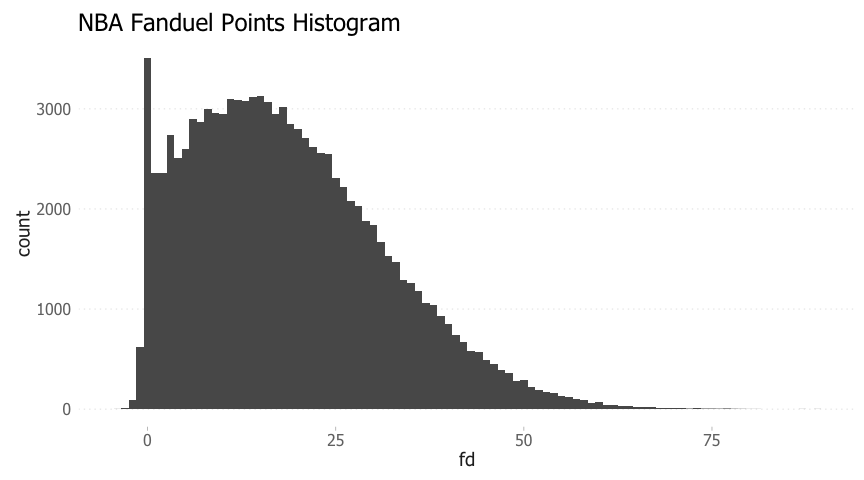

    ##    Min. 1st Qu.  Median    Mean 3rd Qu.    Max. 
    ##   -4.00    8.60   17.10   18.75   26.90   89.00

For the NBA, the FD points distribution is positvely skewed. There is a large number of occurences where players score 0 FD points, despite having played more than 0 minutes in the game. This is due to players recording no statisitcs during their time on the court. The mean and median FD points for all players is 18.8 & 17.1, respectively.

Another interesting observation is that a few players actually get negative FD points, due to a high number of turnovers and lack of other offensive production.

Next, we examine a breakdown of the different player positions.

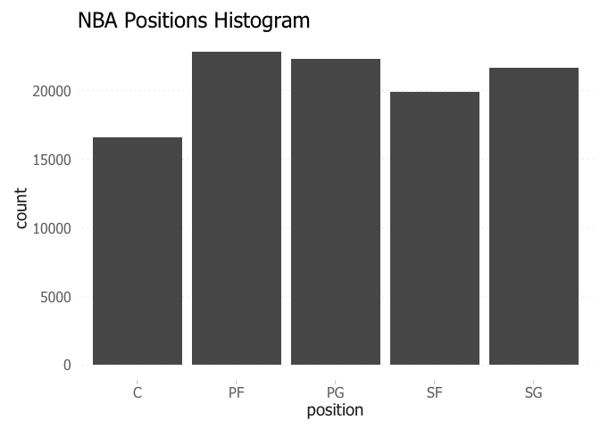

    ## Source: local data table [5 x 2]
    ## 
    ## # tbl_dt [5 x 2]
    ##   position avg_per_game
    ##     <fctr>        <dbl>
    ## 1       PF     2.322925
    ## 2       PG     2.266070
    ## 3       SG     2.202095
    ## 4       SF     2.023088
    ## 5        C     1.685517

In general, there an approximately even number of players across all positions, with centers having slightly fewer numbers. On average, 1.7 centers play per game per team, compared to 2.0-2.3 players at the other positions.

Next, we examine the length of each game. Games that run for extended periods allow players to accumulate more points through increased playing time, leading to higher fantasy production.

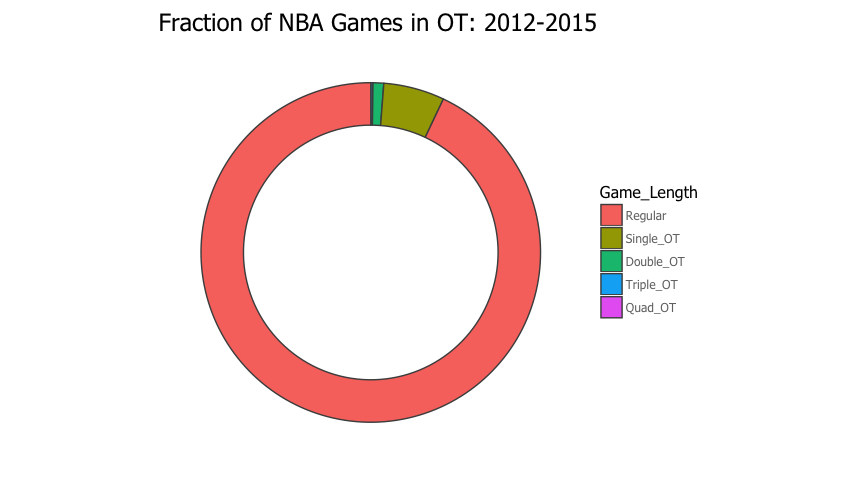

    ##    Game_Length percentage
    ## 1:     Quad_OT       0.02
    ## 2:   Triple_OT       0.19
    ## 3:   Double_OT       1.02
    ## 4:   Single_OT       5.81
    ## 5:     Regular      92.97

As shown, a very small number of games go to overtime; approximately 7%.

Rolling variables over different time windows were computed for multiple variables. These rolling variables should follow very similar distributions to the underlying, un-rolled variable. As a sanity check, the distributions of minutes and minutes over the past X games is shown below.

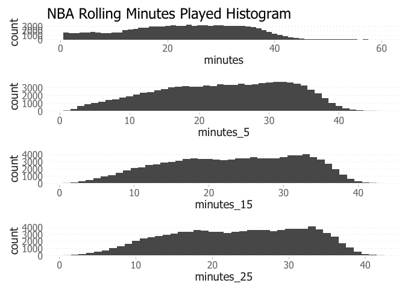

The distributions for the rolling variables look similar to the base minutes distribution. They differ in that the rolling minutes have fewer occurences of low-minute games. Low-minute games (i.e &lt;5 min) are presumably due to cases where a player was injured mid-game, a player was brought in to close a blow-out game, or the player was pulled due to poor play. Intuitevely, these cases should not occur over consecutive games.

<a name="bi_analysis"></a>Bivariate Analysis
--------------------------------------------

Through the univariate analysis, an understanding of the underlying distributions and structure of the dataset was achieved. Next, the relationships between various feature variables and a player's FD points is explored.

A logical starting point is to look at how a player's previous FD points predicts his points on a given night. The plot below examines one of the rolling features created, the mean of the FD points from the last 5 games.

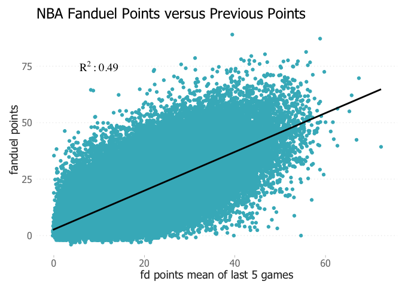

There appears to be a strong trend between FD points and the average of previous FD points. In general, players who put up a lot of points continue to do so, with the opposite holding true as well.

While previous FD points is a strong feature itself, it doesn't account for any factors that may impact a players performance on a nightly basis. A powerful model would be able to explain deviations from a player's mean. To explore one of these factors, a player's playing time is plotted against his FD points.

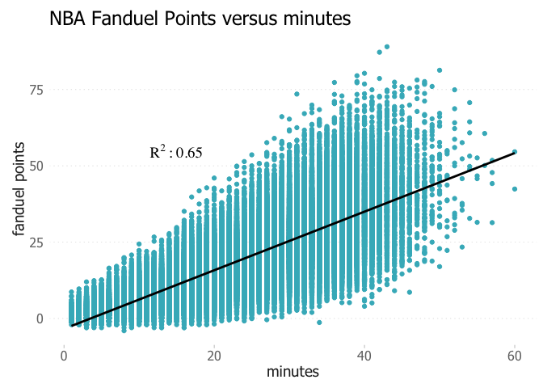

The plot above shows that there is a very strong relationship between minutes played and FD points, R2 ~ 0.65. Minutes correlates significantly stronger than past FD points. This is intuitive, as more time spent on the court allows players produce more, via shots, rebounds, assists etc. It also does a better job of explaining variation from a player's mean, as some nights a player will play more/less as dictated by the flow of the game.

Some people would argue that a more informative variable is a player's FD points per minute, a measure of efficiency.

``` r
##define player efficiency feature
player_data[, eff := fd/minutes]
```

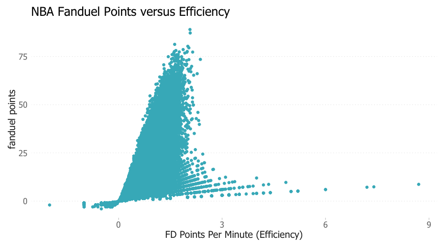

While there appears to be some trend, the data is relatively noisy, due to the presence of some high efficiencies.

``` r
#examine some outliers
glimpse(player_data[eff>3,.(gameID,player,minutes,fd,`3FGM`,FGM,FTM,rebounds,assists,blocks,steals,turnovers)][0:10])
```

    ## Observations: 10
    ## Variables: 12
    ## $ gameID    <fctr> 20121104-phoenix-suns-at-orlando-magic, 20121116-ne...
    ## $ player    <fctr> Kyle O'Quinn, Chris Copeland, Jarvis Varnado, Quinc...
    ## $ minutes   <int> 1, 1, 1, 3, 2, 1, 2, 1, 2, 2
    ## $ fd        <dbl> 3.2, 3.7, 5.2, 9.2, 7.2, 3.5, 6.5, 3.2, 6.5, 7.6
    ## $ 3FGM      <int> 0, 0, 0, 0, 0, 0, 1, 0, 1, 0
    ## $ FGM       <int> 0, 0, 2, 1, 2, 0, 1, 1, 1, 2
    ## $ FTM       <int> 2, 1, 0, 4, 0, 0, 0, 0, 0, 0
    ## $ rebounds  <int> 1, 1, 1, 1, 1, 0, 0, 1, 0, 3
    ## $ assists   <int> 0, 1, 0, 0, 0, 1, 1, 0, 1, 0
    ## $ blocks    <int> 0, 0, 0, 0, 0, 0, 0, 0, 0, 0
    ## $ steals    <int> 0, 0, 0, 1, 1, 1, 1, 0, 1, 0
    ## $ turnovers <int> 0, 0, 0, 0, 0, 0, 0, 0, 0, 0

All of these outliers appear to be due to scenarios where players recorded multiple points, assists or rebounds in under 3 minutes; clearly un-sustainable production.

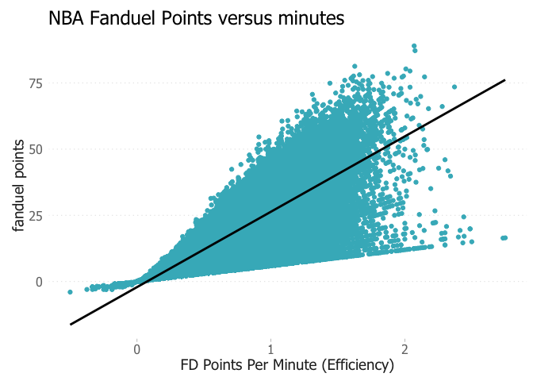

After filtering on minutes&gt;5 and re-plotting, the positive trend between efficiency and FD points becomes more clear.

When building a predictive model, neither minutes played or efffiency will be available before the game. As a result, these variables cannot be used in a model. In order to get a quick glimpse of the predictive power of various features, a correlation matrix is used.

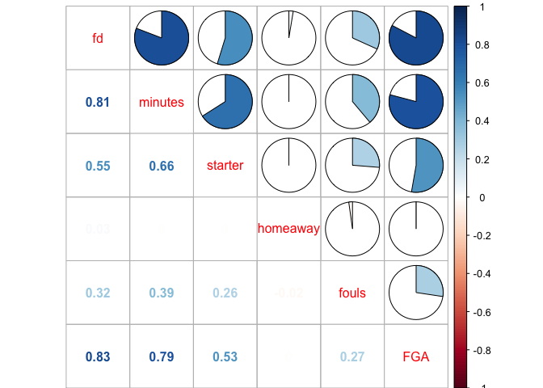

The homeaway variable has the weakest corrleation with FD points. As shown below, the mean fd score is only 0.6 points higher for players at home.

``` r
##mean fd points home versus away
player_data[,.(mean_score=mean(fd)),by = homeaway]
```

    ## Source: local data table [2 x 2]
    ## 
    ## # tbl_dt [2 x 2]
    ##   homeaway mean_score
    ##      <dbl>      <dbl>
    ## 1        1   19.08364
    ## 2        0   18.41699

An additional feature is created to predict minutes played. Playing time can be impacted by injuries, fouls, blowout games or games that go to overtime. In order to predict such instances, more advanced models would be required. A simple way to account for a potential increase or decrease in playing time is to measure the depth (i.e. number of players at each position).

``` r
##build position depth feature
team_depth = player_data[, .(pos_depth=.N - 1) ,by=.(gameID,team,position)]
player_data = player_data %>% inner_join(team_depth)
```

If a starting or backup point guard is injured, the depth at PG will decrease by 1 and signal a potential increase in playing time for the remaining point guards.

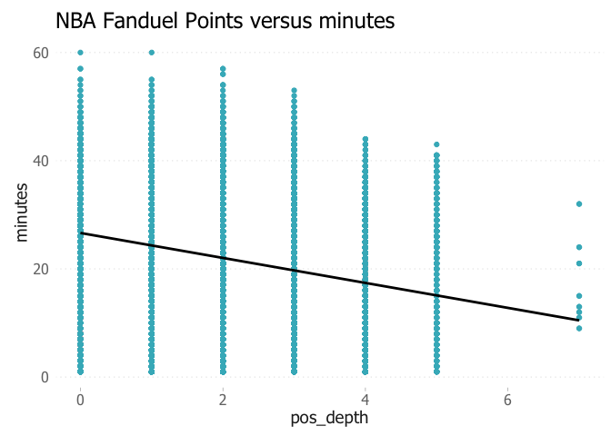

There appears to be a significant trend between positional depth and minutes played. As expected, greater positional depth leads to less playing time. There appears to be some outliers at pos\_depth&gt;5, as it is highly unlikely that a team would carry more than 5 players at a single position.

``` r
##INSPECT pos_depth > 5
glimpse(player_data[pos_depth > 5,.(team,player)][order(player)]) ##-->duplicate player records
```

    ## Observations: 16
    ## Variables: 2
    ## $ team   <fctr> LAL, LAL, GS, GS, GS, GS, LAL, LAL, GS, GS, LAL, LAL, ...
    ## $ player <fctr> Brandon Bass, Brandon Bass, Brandon Rush, Brandon Rush...

Upon further inspection, these instances appear to be cases where there were duplicate player records in the data.

``` r
##get all dupes
glimpse(player_data[, .(count = .N), by = .(gameID,team,player)][count>1, .(gameID,player)])
```

    ## Observations: 109
    ## Variables: 2
    ## $ gameID <fctr> 20151206-dallas-mavericks-at-washington-wizards, 20151...
    ## $ player <fctr> Zaza Pachulia, Ryan Hollins, DeJuan Blair, Dirk Nowitz...

As shown above, a total of 109 duplicates are present. This isn't expected to have a large effect on the data exploration due to the relatively small number of occurences.

Next, the correlation of different rolling minutes played is examined.


The average minutes played in the last 5 & 15 games appears to be the strongest predictor of minutes played on a nightly basis.

Next, we examine if certain positions tend to record more minutes than others.

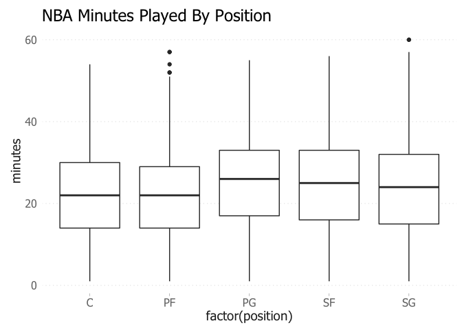

    ## Source: local data table [5 x 2]
    ## 
    ## # tbl_dt [5 x 2]
    ##   position avg_min_played
    ##     <fctr>          <dbl>
    ## 1       PF       21.47340
    ## 2       PG       24.69206
    ## 3       SF       23.71057
    ## 4       SG       23.39125
    ## 5        C       21.91842

Guards & small forwards play more than centers & power forwards on average.

Similar to the rolling minutes variables, we examine which rolling FD points variable correlates the strongest with FD points on a nightly basis.

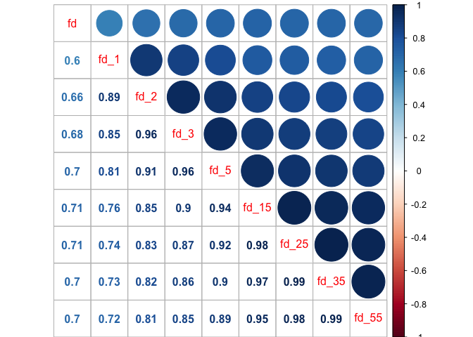

Again, we see that rolling variables over the last 5+ games have the highest correlation with nightly performance.

Next, we see which players tend to record the most FD points.

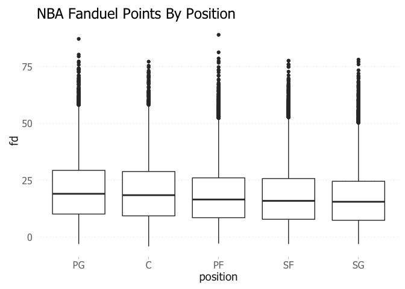

    ## Source: local data table [5 x 2]
    ## 
    ## # tbl_dt [5 x 2]
    ##   position  mean_fd
    ##     <fctr>    <dbl>
    ## 1       SG 16.99232
    ## 2       SF 17.98178
    ## 3       PF 18.33892
    ## 4        C 20.02166
    ## 5       PG 20.62156

Point guards and centers tend to record the most FD points on a nightly basis. For the Fanduel site, lineups must have a fixed number of players at each position. However, other DFS sites allow for flex positions, so targeting point guards & centers in those spots could be an advantageous strategy.

The total fanduel points scored by each team last season is shown below.

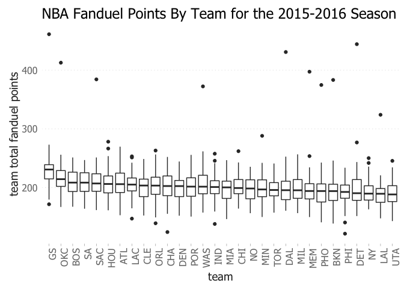

Golden State & Oklahoma City scored the highest number of fantasy points in each game. Targeting players on these teams is a possible strategy.

The total fanduel points allowed by each team last season is shown below.

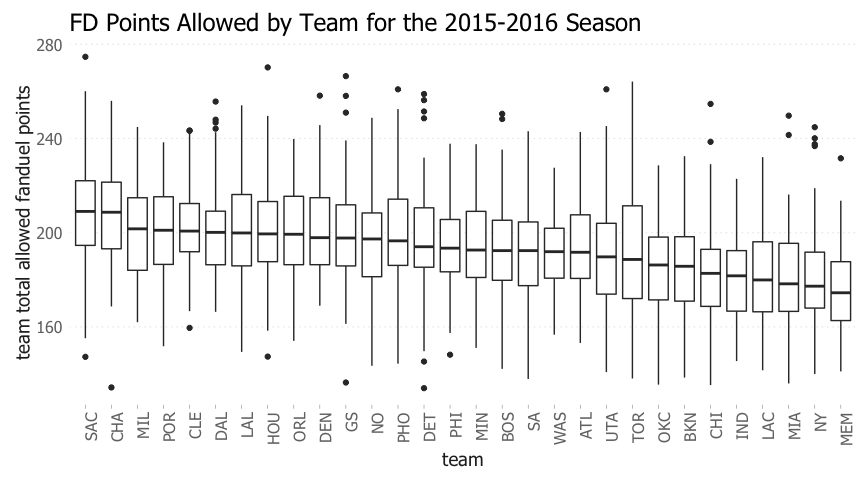

Sacremento & Charlotte had the most porous defenses from a fantasy standpoint. As a result, players competing against these teams could be targeted.

### Stacking

"Stacking" is a popular concept in daily fantasy sports that involves putting players from the same team on your lineup. The idea is that if one player is performing well, his teammates could also benefit through assists or additional opportunities (via rebounds, steals etc.). To explore whether stacking is a viable strategy in the NBA, it is necessary to examine the correlations between players and their teams.

First, we examine how fantasy points correlate at each position.

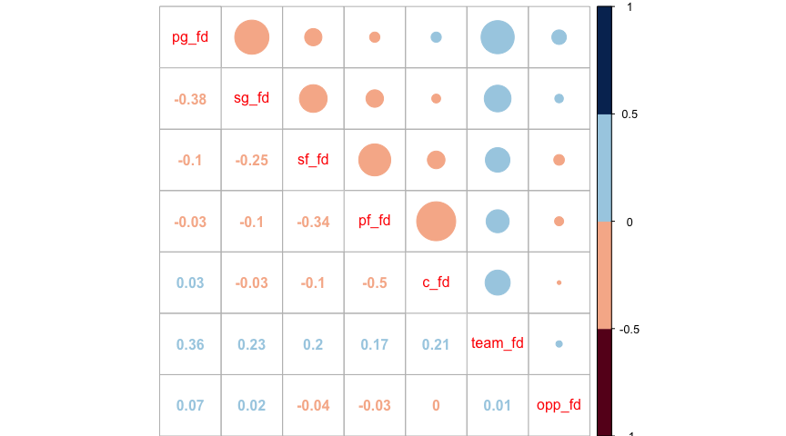

The cell with -0.38 represents the correlation between the total point guard fantasy points and total shooting guard fantasy points. In general, players on the same team are negatively correlated with each other. Intuitively this makes sense, as the stolen shot attempts from one player outweigh the fantasy points generated by assists. The negative correlation is less significant between perimiter & post players (i.e. PG/C or SG/C).

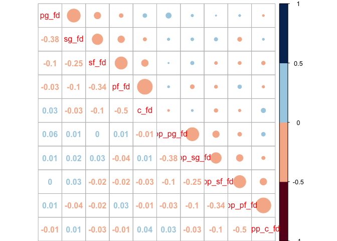

The correlation between opposing players at each position is less significant.

Next, correlation among the starting players is examined (as opposed to bench + startings player from above)

``` r
starter_data = dcast(player_data[starter == 1,], gameID + team ~ position, fun.aggregate = mean, value.var = c('fd'), na.rm=T)
starter_data = as.data.table(starter_data)
```

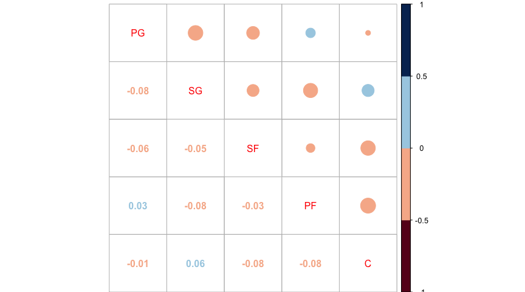

Again, the same trend is shown with perimiters players being negatively correlation with each other, as well as posts.

Next, I examine the impact of high scoring games. First, the team scores (i.e. actual total points scored) are joined to the player data table.

``` r
player_data = player_data %>% inner_join(event_data[,.(gameID,home_score,away_score)])
player_data[, team_score := home_score]
player_data[team == away_team, team_score := away_score]

player_data[, score_bucket := 1]
player_data[team_score > 75, score_bucket := 2]
player_data[team_score > 100, score_bucket := 3]
player_data[team_score > 125, score_bucket := 4]
```

And the results shown below.

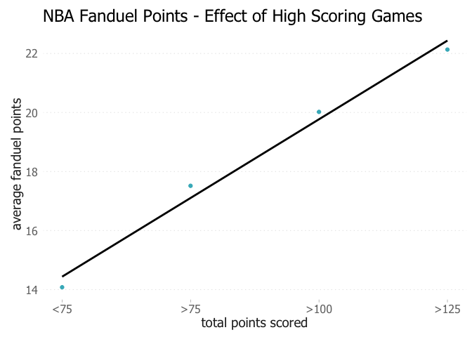

As expected, high scoring games correlate directly with higher fantasy point production. Oddsmaker publish projection point totals for each NBA game, so players playing in high projected point games should be targeted.

Lastly, I examine the effect of weak rebounding teams and teams with lots of turnovers.

``` r
###opponent rebounds and turnovers
opp_stats = team_data[, .(gameID,team,rebounds,turnovers)]
setnames(opp_stats, old=c('team','rebounds','turnovers'), new=c('opponent','opp_rebounds','opp_turnovers'))

player_data = player_data %>% inner_join(opp_stats)
```

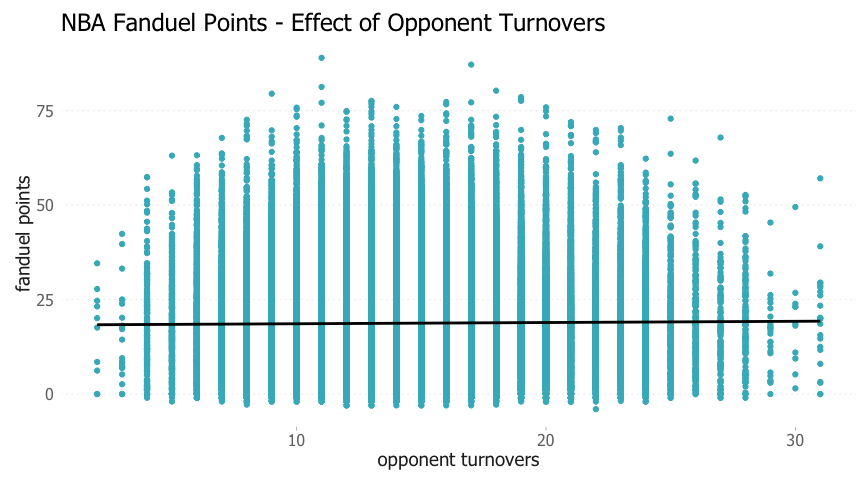

When opposing teams turn the ball over more frequently is does not necessarily lead to higher fantasy production.


Centers and power forwards are expected to benefit from weak rebounding teams due to more fantasy points from rebounds and second-chance baskets. The plot above shows a slightly negative trend (i.e. more rebounds by opponents = lower fantsay point production for PFs/Cs).

<a name="multi_analysis"></a>Multivariate Analysis
--------------------------------------------------

The formula for FD points was shown earlier. The plots below show how the distributions of relevant statistics vary between positions.

``` r
base_stats = player_data[, .(`3FGM` = sum(`3FGM`)/.N , FGM = sum(FGM)/.N, FTM = sum(FTM)/.N,
                          rebounds = sum(rebounds)/.N, assists = sum(assists)/.N,
                          blocks = sum(blocks)/.N, steals = sum(steals)/.N,
                          turnovers = sum(turnovers)/.N, fouls = sum(fouls)/.N),
                         by = .(gameID, position)]

d = melt(base_stats, id.vars = c("gameID", "position"))

ggplot(d, aes(x = value, y = ..count.., colour = position)) + facet_wrap(~variable,scales = "free_x") +
  geom_density() + theme_dlin() + scale_y_continuous(limits = c(0, 10000)) + theme(legend.position="bottom")
```

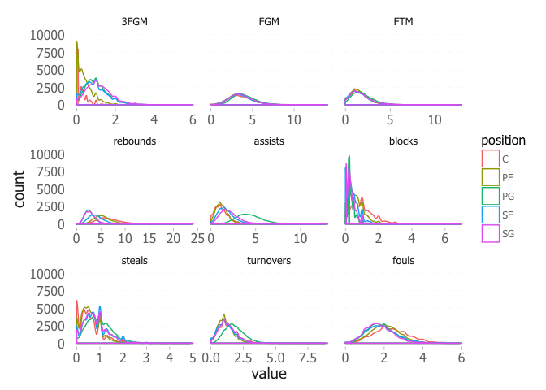

Several conclusions can be drawn from the plot above, all intuitive to someone who has watched the sport. Starting at the top left, centers make the fewest three pointers, followed by power forwards, as indicated by their positvely skewed distributions. Field goals and free throws are similar across all positions. Point guards have the highest number of assists, whereas centers have the highest number of fouls.

As an extension of what was shown above, I plot the total fd points scored/allowed by the teams over each season.

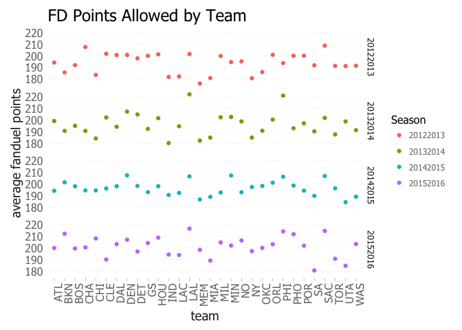

    ## Source: local data table [5 x 2]
    ## 
    ## # tbl_dt [5 x 2]
    ##     team mean_opp_fd
    ##   <fctr>       <dbl>
    ## 1    MEM    185.8448
    ## 2    MIA    185.9177
    ## 3    IND    186.7009
    ## 4     SA    188.0863
    ## 5    UTA    189.6550

    ## Source: local data table [5 x 2]
    ## 
    ## # tbl_dt [5 x 2]
    ##     team mean_opp_fd
    ##   <fctr>       <dbl>
    ## 1    HOU    202.3774
    ## 2    DEN    205.5247
    ## 3    SAC    207.9015
    ## 4    PHI    208.6854
    ## 5    LAL    211.5835

The plot above helps identify teams that are consistently weak defensively. Over the past 4 seasons, the Lakers has been one of the weakest defensive teams (from a fantasy points perspective) whereas Memphis has been the strongest.

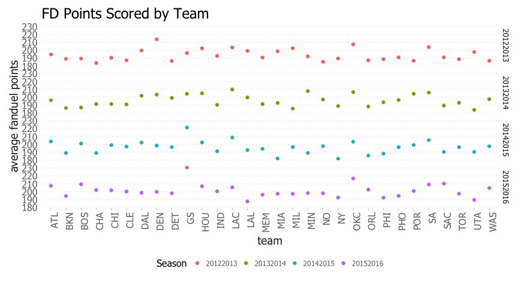

    ## Source: local data table [5 x 2]
    ## 
    ## # tbl_dt [5 x 2]
    ##     team mean_team_fd
    ##   <fctr>        <dbl>
    ## 1     GS     213.1957
    ## 2    OKC     208.4521
    ## 3    LAC     206.8482
    ## 4     SA     206.0488
    ## 5    HOU     204.1966

    ## Source: local data table [5 x 2]
    ## 
    ## # tbl_dt [5 x 2]
    ##     team mean_team_fd
    ##   <fctr>        <dbl>
    ## 1    ORL     190.9850
    ## 2    PHI     190.7549
    ## 3    UTA     190.4749
    ## 4    BKN     189.7494
    ## 5     NY     188.1829

Golden State and Oklahoma City have been the top fantasy point scoring teams whereas New York & Brooklyn have been the worst across each season.

Next, we see which teams give up the most points to each position.

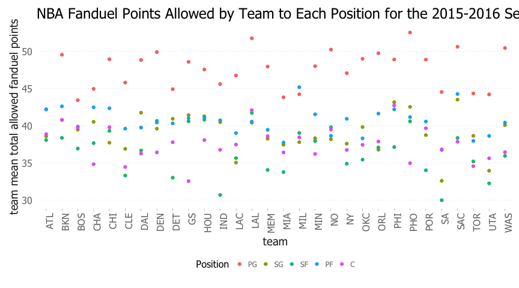

    ##    season_code team  variable    value
    ## 1:    20152016  LAL opp_pg_fd 51.75854
    ## 2:    20152016  PHO opp_pg_fd 52.53049

    ##    season_code team variable    value
    ## 1:    20152016  LAL opp_c_fd 42.08780
    ## 2:    20152016  PHI opp_c_fd 42.72317

The Lakers gave up the most points to opposing point guards and centers, followed closely by Phoenix (point guards) and Philadelphia (centers).

    ##    season_code team  variable    value
    ## 1:    20152016  ATL opp_pg_fd 42.20732
    ## 2:    20152016  BOS opp_pg_fd 43.42073

    ##    season_code team variable    value
    ## 1:    20152016   GS opp_c_fd 32.54268
    ## 2:    20152016  CLE opp_c_fd 34.44512

Atlanta & Boston gave up the least amount of points to opposing point guards whereas Golden State and Cleveland were the best at containing opposing centers.

The same analysis can be applied at the individual player level. Lebron's performance against teams each season is show.

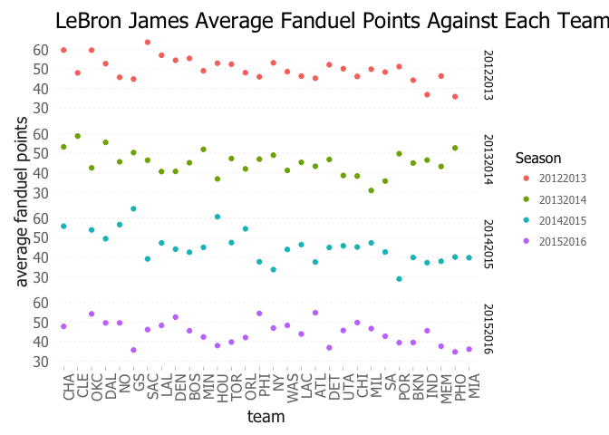

    ## Source: local data table [5 x 2]
    ## 
    ## # tbl_dt [5 x 2]
    ##   opponent  mean_fd
    ##     <fctr>    <dbl>
    ## 1      PHO 40.80000
    ## 2      MEM 41.25000
    ## 3      IND 41.49375
    ## 4      BKN 42.10417
    ## 5      POR 42.27500

    ## Source: local data table [5 x 2]
    ## 
    ## # tbl_dt [5 x 2]
    ##   opponent  mean_fd
    ##     <fctr>    <dbl>
    ## 1       GS 48.85000
    ## 2       NO 49.33750
    ## 3      DAL 51.75000
    ## 4      OKC 52.50000
    ## 5      CHA 54.05833

Lebron scored the most against Charlotte and OKC across his past 4 seasons, and was held to his lowest average fantasy points against Portland and Brooklyn.

<a name="final"></a>Final Plots and Summary
-------------------------------------------

The first final plot chosen was created using one of the engineered feature variables. The variable created was the amount of fantasy points allowed by each team to each opposing position for every game. The plot below shows the average fantasy points allowed to each position over all seasons present in the data set.

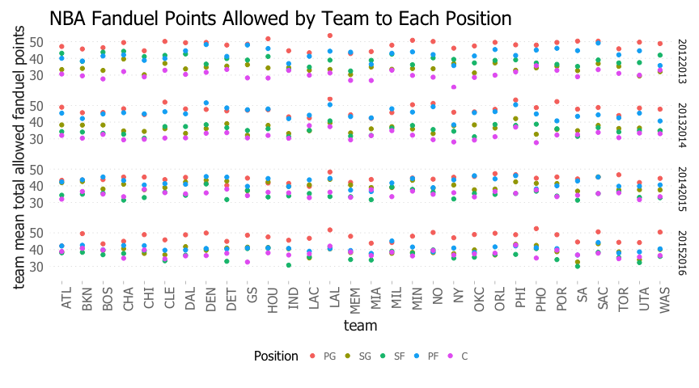

Multiple insights can be drawn from this plot. All teams allow the most fantasy points to opposing point guards, which was also reflected in a previous plot that showed average fantasy points at each position. The plot also allows for identification of both friendly and un-friendly teams to target in each matchup. For example, Memphis & San Antonio have been two of the strongest defensive teams, allowing the fewest fantasy points to all positions each season. On the other hand, the LA Lakers have been one of the most porous teams.

Based on this, a potential feature variable in a predictive model could be a rolling average of fantasy points allowed to each position.

The second plot chosen was a combination of the correlation plots shown earlier.

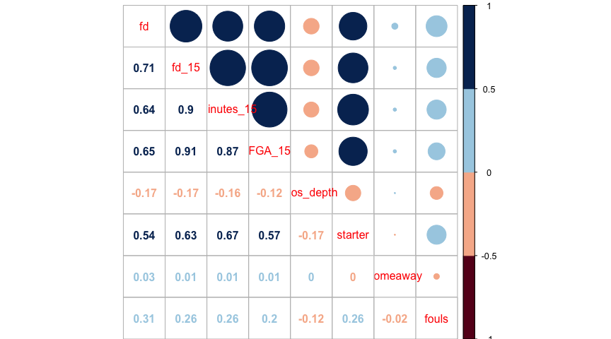

The plot above does a good job of summarizing the variables that have strong positive or negative relationships with fantasy points.

The third plot chosen was another correlation matrix, this time between various positions. The plot is particularly important for coming up with a stacking strategy.

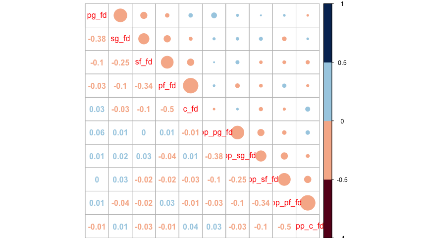

In general, players on the same team are negatively correlated with each other. The negative correlation is less significant between perimiter & post players (i.e. PG/C or SG/C). The correlation between opposing players at each position is less significant. As a result, choosing players on opposite teams should not have a negative impact on fantasy production, unlike other matchup based fantasy spots where opposing players are more negatively correlated (i.e. hockey goalies & opposing skaters, baseball pitchers and opposing batters).

Overall, many of the feature variables explored show strong linear correlations with fantasy points, laying the groundwork for a powerful, predictive model to be built.

<a name="reflection"></a>Reflection
-----------------------------------

Overall, using R for the exploratory data analysis was a good experience as the language and development environment in R studio make work quick and easy. Once I learned the syntax of data.table and ggplot, and the useful library reshape, data cleaning, massaging and aggregating became extremely quick and efficient. Being able to quickly group, select and aggregate to produce stats along with plots made the analysis more thorough and informative. Most difficulties encountered were related to formatting with ggplot2 (i.e. changing label title, creating facet grids, custom x-axis labels etc.). Despite these minor difficulties, I find plotting with R & RStudio a much better experience than Python.

For future work, it is recommended to add in other data sources to explore additional variables that may impact fantasy points. For example, vegas odds variables such as win probability or total projected points could be useful. The analysis showed that games that go to overtime or are high scoring yield higher average fantasy point totals, so games with narrow win margins or high projected point totals could be targeted.
